Nama: Jessica Tandra  
NPM: 2406355445  
Kelas: Adpro-B  

## Performance Testing

### 1. Endpoint: `/all-student`
| Metric | Before Optimization |                          After Optimization                          |
| :--- | :---: |:--------------------------------------------------------------------:|
| **JMeter (GUI)** | 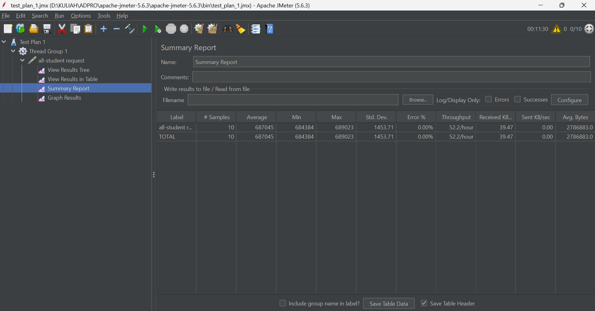 |  |
| **JMeter (CLI)** |  |       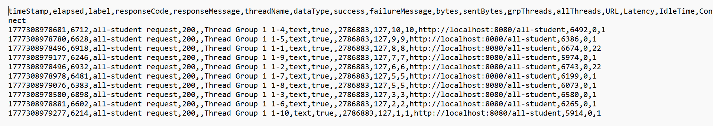        |

### 2. Endpoint: `/all-student-name`
| Metric | Before Optimization |                            After Optimization                             |
| :--- | :---: |:-------------------------------------------------------------------------:|
| **JMeter (GUI)** |  |  |
| **JMeter (CLI)** | 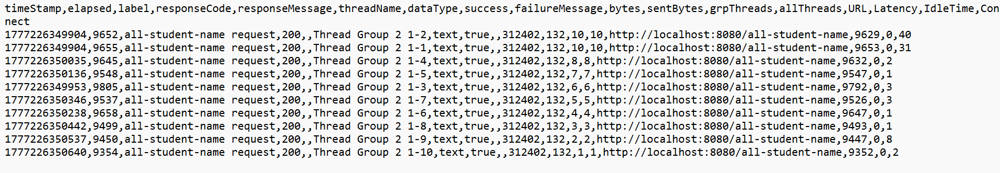 |       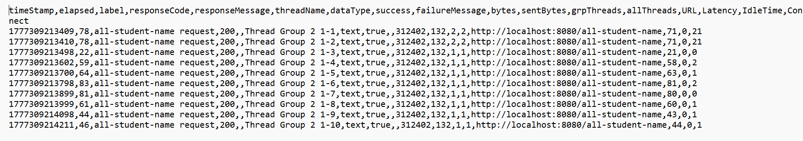        |

### 3. Endpoint: `/highest-gpa`
| Metric | Before Optimization |                          After Optimization                          |
| :--- | :---: |:--------------------------------------------------------------------:|
| **JMeter (GUI)** |  |  |
| **JMeter (CLI)** |  |       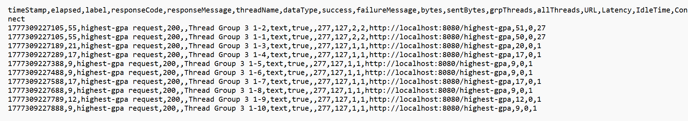        |

## Profiling & Code Optimization

### 1. Endpoint: `/all-student`
| Profiling Before | Profiling After |
| :---: | :---: |
| 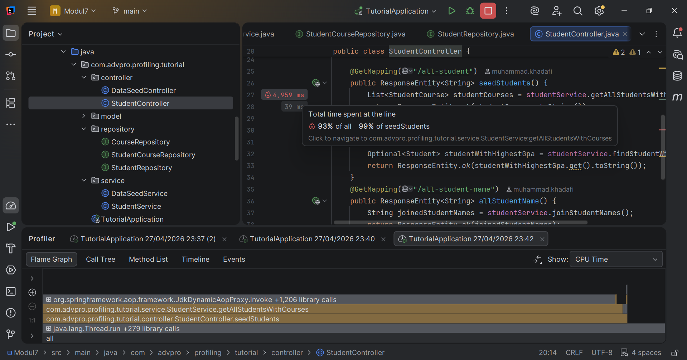 | 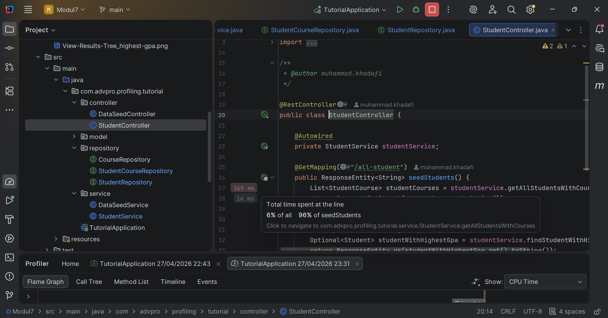 |

### 2. Endpoint: `/all-student-name`
| Profiling Before | Profiling After |
| :---: | :---: |
| 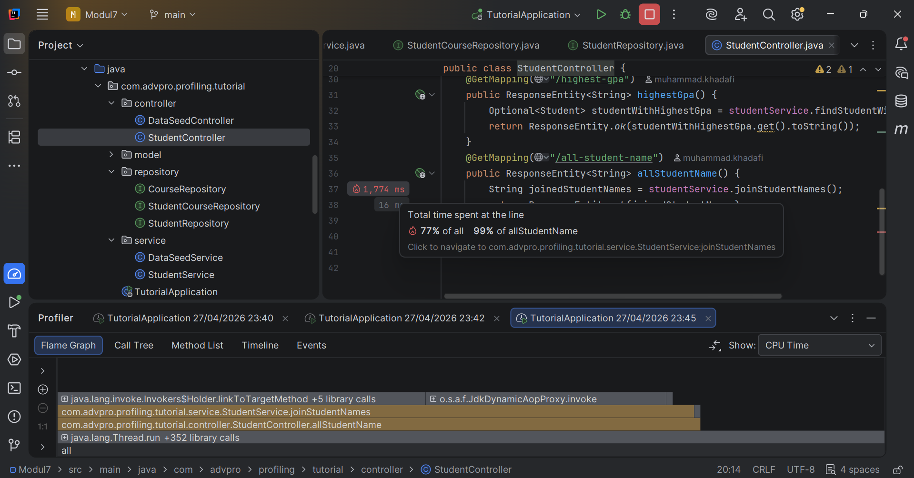 | 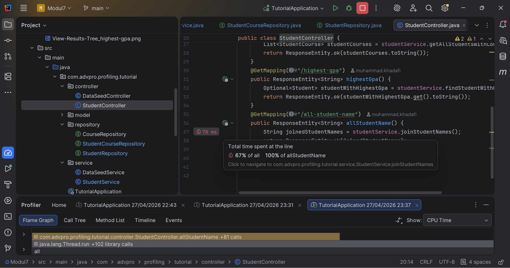 |

### 3. Endpoint: `/highest-gpa`
| Profiling Before | Profiling After |
| :---: | :---: |
| 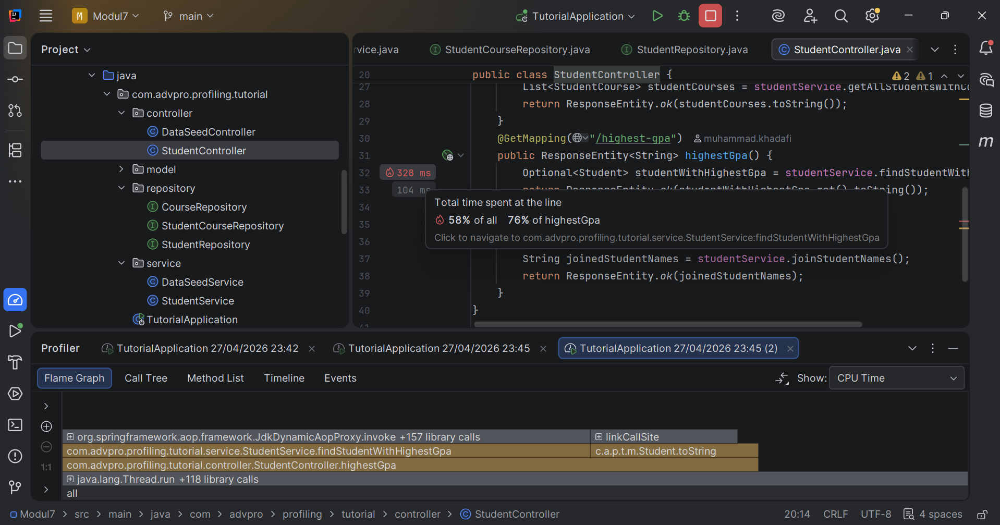 | 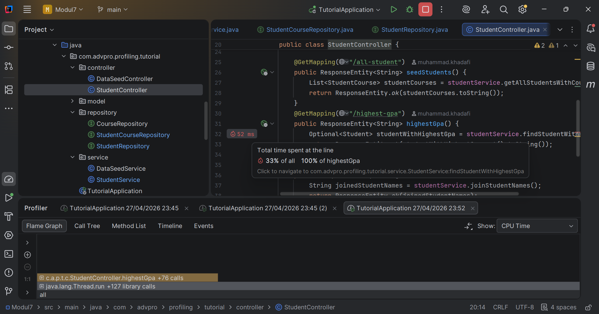 |

## Kesimpulan Umum & Perbandingan Hasil

Berdasarkan pengujian dengan Apache JMeter dan IntelliJ Profiler, terdapat peningkatan performa yang sangat signifikan setelah dilakukan optimasi kode pada `StudentService`. Berikut adalah ringkasan perbandingannya:

### Perbandingan Hasil JMeter (Rata-rata Sample Time dalam ms)
| Endpoint |  Sebelum   | Sesudah  |  Peningkatan   |
| :--- |:----------:|:--------:|:--------------:|
| `/all-student` | 687.045 ms | 4.502 ms | ~99,3% lebih cepat |
| `/all-student-name` | 13.291 ms  |  79 ms   | ~99,4% lebih cepat |
| `/highest-gpa` |  2.844 ms  |  47 ms   | ~98,3% lebih cepat |

### Perbandingan Hasil IntelliJ Profiler (CPU Time dalam ms)
| Endpoint | Sebelum  | Sesudah |  Peningkatan   |
| :--- |:--------:|:-------:|:--------------:|
| `/all-student` | 4.959 ms | 369 ms  | ~92,5% lebih cepat |
| `/all-student-name` | 1.774 ms |  78 ms  | ~95,6% lebih cepat |
| `/highest-gpa` |  328 ms  |  52 ms  | ~84,1% lebih cepat |

1. **Endpoint: `/all-student`**
- **Kondisi awal:** Endpoint ini memiliki waktu respons paling tinggi di JMeter, dengan rata-rata sampel mencapai lebih dari 687 detik. Hal ini disebabkan oleh masalah N+1 query, di mana aplikasi berulang kali mengirim ribuan query terpisah hanya untuk memuat relasi course dari setiap mahasiswa.
- **Hasil optimasi:** Dengan menerapkan JOIN FETCH pada repository, seluruh data beserta relasinya dapat diambil dalam satu query. Perubahan ini menurunkan waktu eksekusi CPU dari 4.959 ms menjadi 369 ms. Dampaknya juga terlihat pada JMeter, di mana throughput meningkat signifikan dan waktu sampel turun hingga 99,3%.

2. **Endpoint: `/all-student-name`**
- **Kondisi awal:** Hasil profiling menunjukkan waktu CPU yang cukup tinggi, yaitu sekitar 1.774 ms, yang sebagian besar dihabiskan untuk manipulasi string di dalam loop. Penggunaan operator += menyebabkan pembuatan objek string baru secara terus-menerus, sehingga membebani memori dan kinerja garbage collector.
- **Hasil optimasi:** Pendekatan ini diperbaiki dengan menggunakan JPA Projection untuk membatasi data yang diambil hanya pada kolom nama, serta mengganti metode penggabungan string dengan cara yang lebih efisien. Setelah perubahan, penggunaan CPU turun menjadi 78 ms, dan rata-rata waktu respons di JMeter berada di sekitar 79 ms, atau lebih cepat 99,4%.

3. **Endpoint: `/highest-gpa`**
- **Kondisi awal:** Aplikasi sebelumnya menggunakan pendekatan brute-force dengan mengambil seluruh data mahasiswa ke dalam memori melalui findAll(), lalu mencari nilai IPK tertinggi menggunakan iterasi manual. Cara ini tidak efisien dan sulit diskalakan ketika jumlah data meningkat.
- **Hasil optimasi:** Proses pencarian dipindahkan ke database menggunakan derived query dengan limitasi data. Dengan perubahan ini, waktu eksekusi CPU berkurang hingga 84,1%, dan waktu respons di JMeter turun dari hampir 3 detik menjadi sekitar 47 milidetik.

**Kesimpulan**  
Penggunaan IntelliJ Profiler membantu mengarahkan proses refactoring ke bagian yang menjadi bottleneck, baik dari sisi query, penggunaan memori, maupun proses komputasi. Setelah perbaikan dilakukan, hasil pengujian dengan JMeter menunjukkan bahwa aplikasi mampu menangani beban secara lebih efisien dan stabil, tanpa mengubah fungsionalitas yang sudah ada.

## Reflection

> 1. What is the difference between the approach of performance testing with JMeter and profiling with IntelliJ Profiler in the context of optimizing application performance?

JMeter menggunakan pendekatan eksternal dengan mensimulasikan sejumlah besar request pengguna untuk mengukur performa sistem secara keseluruhan, seperti waktu respons dan throughput. Melalui pendekatan ini, dapat diamati bagaimana aplikasi berperilaku ketika menerima beban yang tinggi. Di sisi lain, IntelliJ Profiler bekerja dari dalam aplikasi dengan memantau proses eksekusi, termasuk penggunaan CPU, memori, serta waktu yang dibutuhkan oleh setiap method. Dengan demikian, JMeter berperan dalam mengidentifikasi gejala penurunan performa dari perspektif eksternal, sedangkan Profiler membantu menelusuri penyebabnya secara lebih mendalam pada level kode sehingga bagian yang perlu diperbaiki dapat diketahui secara lebih spesifik.

> 2. How does the profiling process help you in identifying and understanding the weak points in your application?

Proses profiling membantu mengidentifikasi titik lemah aplikasi dengan memberikan gambaran mengenai apa yang terjadi di balik eksekusi pada JVM, seperti alokasi waktu CPU dan penggunaan memori pada setiap method. Melalui visualisasi seperti flame graph maupun metrik waktu eksekusi dalam milidetik, analisis performa tidak lagi bergantung pada perkiraan semata, karena profiler dapat menunjukkan secara langsung bagian kode yang menjadi bottleneck. Dalam konteks tugas ini, hasil profiling memperlihatkan bahwa sebagian besar waktu eksekusi terpusat pada method tertentu. Dari situ, akar permasalahan seperti N+1 query dan inefisiensi dalam proses looping dapat diidentifikasi dengan lebih jelas dan kemudian diperbaiki melalui proses refactoring.

> 3. Do you think IntelliJ Profiler is effective in assisting you to analyze and identify bottlenecks in your application code?

IntelliJ Profiler merupakan alat yang efektif untuk menganalisis serta mengidentifikasi bottleneck pada kode aplikasi. Fitur visual yang disediakan, seperti flame graph dan informasi waktu eksekusi (dalam milidetik) yang ditampilkan langsung di samping baris kode, membantu proses penelusuran sumber permasalahan menjadi lebih jelas dan terarah. Melalui profiler ini, letak inefisiensi dapat terlihat secara langsung, misalnya pada kasus N+1 query yang membebani database atau penggunaan memori yang meningkat akibat proses looping yang kurang efisien. Dengan demikian, proses identifikasi akar masalah performa yang sebelumnya memerlukan waktu cukup lama dapat dilakukan dengan lebih cepat dan tepat sasaran.

> 4. What are the main challenges you face when conducting performance testing and profiling, and how do you overcome these challenges?

Tantangan utama dalam melakukan performance testing menggunakan JMeter terletak pada proses analisis serta menjaga agar metrik seperti throughput dan waktu respons tetap konsisten ketika aplikasi menerima banyak request secara bersamaan. Di sisi lain, pada tahap profiling sering muncul anomali pada metrik, salah satunya akibat efek JVM warm-up, di mana eksekusi awal aplikasi cenderung tercatat lebih lambat dari kondisi normal. Untuk mengatasi hal tersebut, dilakukan beberapa request pemanasan sebelum proses perekaman performa dimulai. Dengan cara ini, hasil analisis yang diperoleh menjadi lebih representatif dan dapat menggambarkan kondisi aplikasi secara lebih objektif.

> 5. What are the main benefits you gain from using IntelliJ Profiler for profiling your application code?

Manfaat utama penggunaan IntelliJ Profiler adalah integrasinya yang langsung dengan IDE, sehingga pemantauan performa dapat dilakukan tanpa berpindah ke alat lain. Fitur visual seperti flame graph dan indikator waktu eksekusi (ms) pada baris kode membantu mengidentifikasi bottleneck secara cepat dan tepat. Dengan demikian, proses debugging menjadi lebih efisien, sekaligus memberikan pemahaman yang lebih jelas mengenai penggunaan memori dan CPU, sehingga refactoring dapat dilakukan secara lebih terarah.

> 6. How do you handle situations where the results from profiling with IntelliJ Profiler are not entirely consistent with findings from performance testing using JMeter?

Ketidakkonsistenan ini merupakan hal yang wajar karena JMeter mengukur performa secara end-to-end yang turut dipengaruhi oleh faktor seperti network latency dan HTTP overhead, sedangkan profiler berfokus pada waktu eksekusi internal di dalam JVM. Selain itu, faktor teknis seperti efek JVM warm-up dapat menyebabkan metrik awal pada profiler terlihat lebih lambat meskipun throughput pada JMeter sudah menunjukkan peningkatan. Untuk menyikapinya, kedua alat ini digunakan secara saling melengkapi. Profiler difokuskan untuk mengidentifikasi dan mengoptimalkan bagian kode, sementara JMeter digunakan untuk memvalidasi apakah perbaikan tersebut benar-benar memberikan dampak yang nyata terhadap performa dari sisi pengguna.

> 7. What strategies do you implement in optimizing application code after analyzing results from performance testing and profiling? How do you ensure the changes you make do not affect the application's functionality?

Strategi optimasi difokuskan pada efisiensi memori serta pemindahan beban komputasi ke database, misalnya dengan menggunakan JOIN FETCH untuk mengatasi N+1 query dan memanfaatkan derived query daripada melakukan looping di memori Java. Selain itu, operasi yang boros resource dihindari, seperti penggunaan string concatenation di dalam loop yang diganti dengan pendekatan yang lebih efisien. Untuk menjaga konsistensi fungsionalitas, dilakukan verifikasi respons endpoint secara manual melalui browser atau Postman agar hasil sebelum dan sesudah refactoring tetap sama. Pengujian fungsional maupun unit test juga dijalankan secara rutin untuk memastikan optimasi tidak mengganggu logika bisnis yang ada.