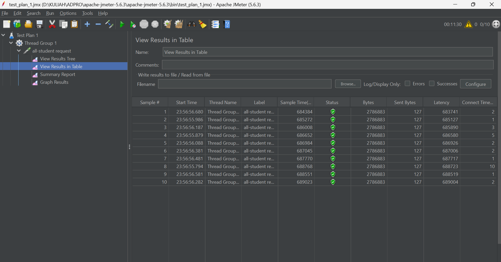
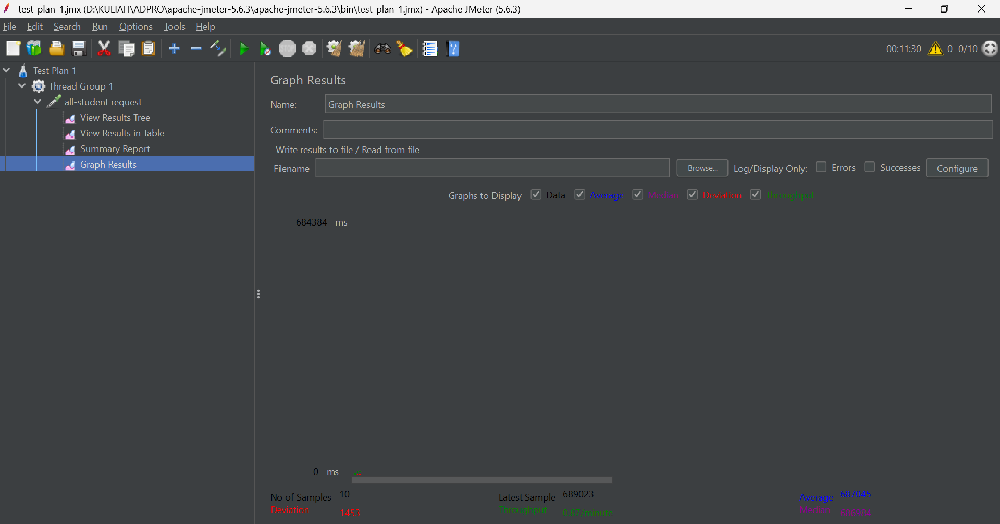
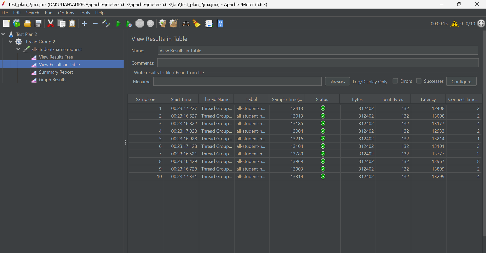
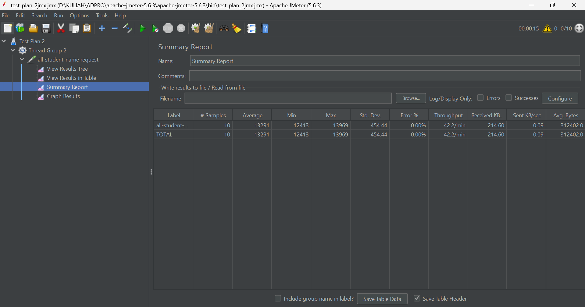
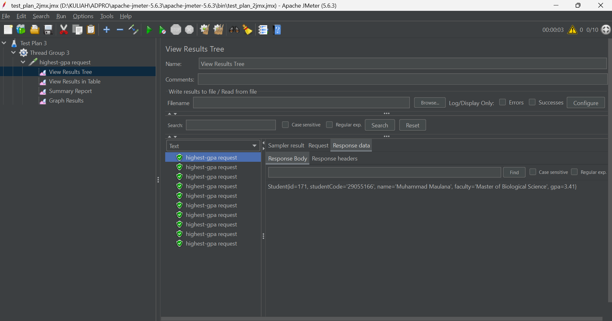
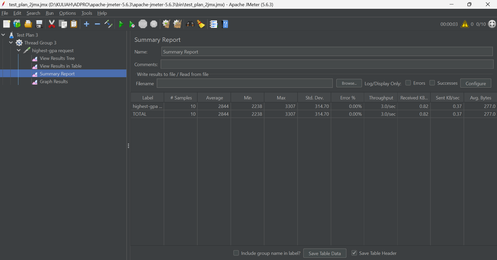
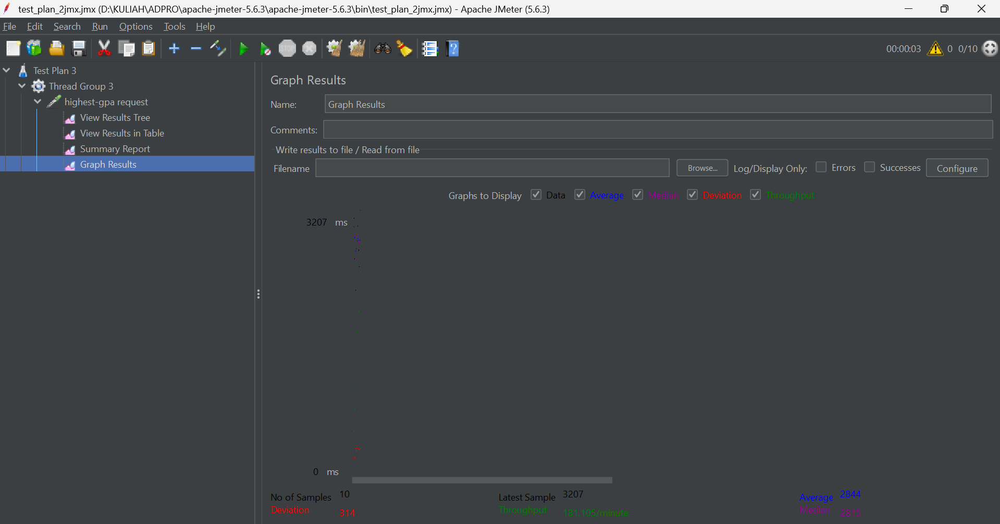
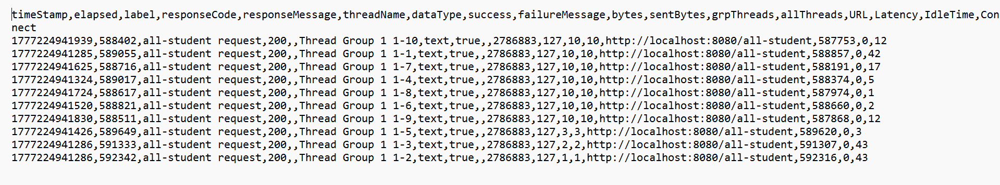
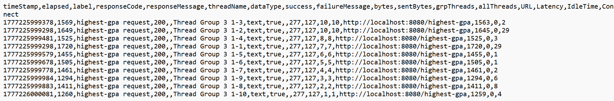

<b>Performance Testing Results</b>

## Test Results (Via GUI)
### /all-students
**View Results Tree**

**View Results Table**

**Summary Report**

**Graph Results**

### /all-student-name
**View Results Tree**

**View Results Table**

**Summary Report**

**Graph Results**

### /highest-gpa
**View Results Tree**

**View Results Table**

**Summary Report**

**Graph Results**

## Test Results (Via CLI)
### /all-students

### /all-student-name

### /highest-gpa

